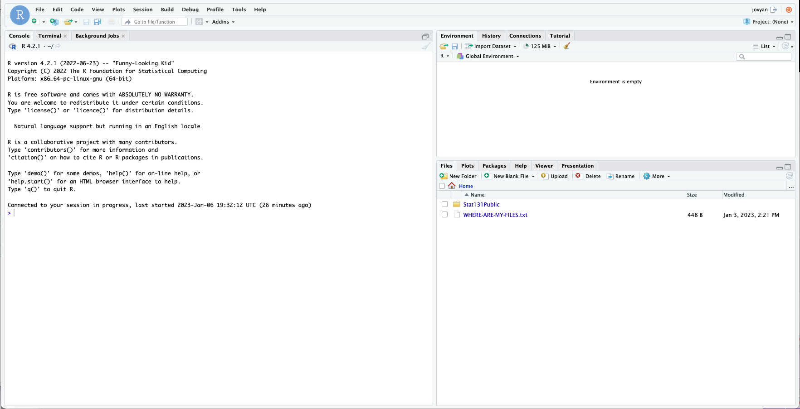

```{r setup, include=FALSE}
knitr::opts_chunk$set(echo = TRUE)
```

# Welcome! 👋

Welcome to Lab 0 of Stat 131A!

-   This lab is intended familiarize you with `R`, a statistical programming language, and `RStudio`, the most popular software for interacting with `R`.
-   You do not have to submit Lab 0. But, you should work through it before the first lab session on **Tuesday of Week 2**.

We expect that parts of Lab 0 will be review for some folks, and other parts will be brand new.

-   **Former Data 8 Students**: `R` and `RStudio` are likely brand new for you. You are likely familiar with many of the concepts in the lab, but the syntax is new.
-   **Former Stat 20 Students**: You are likely familiar with `R` and `RStudio`, but there may be coding concepts in the lab that are new to you.

Remember, **you do not need to know anything about `R` before taking 131A.**

-   If you have met the course pre-requisites, you are qualified to be here!

This lab is self-paced.

-   In other words, you should try to complete the lab independently.
-   That being said, the teaching staff is here for support!
-   Contact us via Ed if you have questions. **For Lab 0 only, you are allowed to use ChatGPT for help.** See the syllabus for the 131A large-language model (LLM) policy, which only allows an LLM designed specifically for 131A.

# Orienting to the HTML version of the lab 🧭

The first time you read this, you are probably looking at the pretty **HTML version** of the lab.

-   Later in the lab, we will link to the **interactive R Markdown (`.Rmd`)** version.
-   In the `.Rmd` version, you will be able to run `R` code.

Notice the **table of contents** on the left-hand side of the page.

-   Click on it to see how it works!

# RStudio and DataHub 🖥

`RStudio` is an open-source Integrated Development Environment (IDE) designed specifically for `R`.

-   RStudio can be run from your computer, or in the cloud via DataHub.

-   The course staff will use DataHub version of `RStudio` in 131A, but you are free to use the local version if you prefer.

Here's what `RStudio` looks like in DataHub:



The files you see in the lower right corner may look a little different.

-   You should see the folder `131a-labs-public-fall-2024`.
-   This will be where the necessary files for each lab will be located (e.g., data files, code files, etc.).

### Transitioning to DataHub 🚂

It's time to transition to the interactive version of the lab!

**Important note:** When you click the URL below, the first thing you should do is notice the `Source` and `Visual` buttons at the top left of the screen.
**Click on `Visual` to make the lab easier to read!**.

-   To open Lab 0 in DataHub, click on this URL: <https://r.datahub.berkeley.edu/hub/user-redirect/git-pull?repo=https%3A%2F%2Fgithub.com%2Fepurdom%2FStat131Public&urlpath=rstudio>

**At this point in Lab 0, we will assume you are working from `RStudio` in DataHub, and not looking at the HTML version of the lab.**

-   You are welcome to keep the HTML version open in a separate window for reference.

## Your first code chunk 👶

The short block of code below is called a **code chunk** or **code cell**.

-   Data 8 folks: Jupyter notebooks also have code cells! `RMarkdown` notebooks, like this lab, function very similarly to Jupyter notebooks.

To run the code cell, press the green ▶️ button on the right side of the code cell.

```{r}
a = 1:5
a
```

The output should be `[1] 1 2 3 4 5`.

-   `1:5` produces a vector of the integers 1 through 5.

-   For now, ignore the `[1]` on the left of the output.

-   More on `R` syntax shortly!

To add a new code cell, press the  button towards the top right of the `RStudio` window.

-   Place your cursor on the blank line below and try adding an `R` code chunk!

# Quick introduction to `R` syntax 🤖

Now that you're familiar with the basics of `RMarkdown` notebooks, let's dive into `R` syntax.

## Variable assignment 📦

The basics of variable assignment are quite similar to `Python`.

-   However, in `R`, the assignment operator `<-` can be used for variable assignment, in addition to `=` .

-   In general, we recommend sticking to `=` .

```{r}
val = 3
print(val)

new_val <- 7
print(new_val)

val-new_val
```

Note that the last line is printed, even though we never explicitly called `print()`.

-   `R` will print non-assignment lines of code chunks by default.

## Arithmetic Operators 🧮

```{r}
# four function calculator
2 + 3
2 - 3
2 * 3
2 / 3

# exponentiation
3^4

# square root
sqrt(16)

# logarithm with base e
log(10)

# exponential
exp(2)

# absolute value
abs(-2)
```

## Data Types 📀

R has similar data types as in python: numeric values, integer values, characters (i.e., strings), and logicals (i.e., booleans, TRUE/FALSE).

> ***Python Users:*** In R the boolean value is `TRUE` or `FALSE` (all caps), while in Python it would be `True` or `False`

In `R`, we can often test the data type with `is.XXXXX`

```{r}
is.character("my name is")
is.numeric(5)
is.logical(TRUE)
```

We can cast to new data types with `as.XXXX`

```{r}
as.character(10)
as.numeric('100')
as.logical(1)
```

## Relational and logical operators ⚖️

The basic numerical comparisons are `<`, `<=`, `>`, `>=`.

We use `&` for AND , `|` for OR, and `!` for NEGATE.

> ***Python Users:*** In Python, these are `and`, `or`, and `not`.

```{r}
1 > 0
TRUE | FALSE
TRUE & FALSE
! TRUE
```

# Vectors 🛤️

Vectors store a series of values of the same data type.

Vectors can be created with `c()` , which stands for concatenate.

```{r}
a = c(0.125, 4.75, -1.3)
a
```

Whats the `[1]` on the left?

-   It will be more clear if we make a long vector!

```{r}
100:150
```

The bracketed numbers provide the index of the value immediately to the right.

-   `[17]` means that `116` is the `17`th number in the sequence.

-   **Important note:** Unlike Python, `R` is one-indexed.
    In other words, the first element of an `R` vector (or any other object) is indexed with `[1]`.

We can also use `c()` to combine existing vectors

```{r}
b = c(0, 1, -1)
b

new_vec = c(a, b)
new_vec
```

All elements of a vector must have the same type.

-   If you need to combine elements of different types, use `list()`.

```{r}
list(TRUE, 1, 'hello')
```

## Creating sequences with `seq`

The function `seq` generates sequences of numbers with a similar pattern.

```{r}
seq1 = seq(from=4, to=9, by=1)
seq1
```

You can also write function `seq(from=a, to=b, by=1)` as `a:b`

```{r}
seq2 = 1:6
seq2
```

To see the documentation of a function, put `?` in front of it.

```{r}
?seq
```

## Vectorized calculations

In `R`, mathematical operations on vectors are usually done element-wise, meaning the operation is done on each element of the vector.

Let $x=(x_1,x_2,\ldots,x_n$ and $y=(y_1,y_2,\ldots,y_n)$.

Then `x*y` will return the vector $(x_1 y_1, x_2 y_2,\ldots,x_n y_n)$

```{r}
vec1 = c(1,2,3)
vec2 = c(3,4,5)

vec1 * vec2
```

This vectorization works with other functions, too:

```{r}
vec1 + vec2
vec1 / vec2
vec1 > 2
```

## Indexing and subsetting vectors 🔪

> ***Python Users:*** Python and `R` indexing are different.
> Pay extra attention to this section!

You can index elements of a vector with `[ ]`.

```{r}
vector1 <- 11:20

# the first element 
vector1[1]

# the tenth element
vector1[10]
```

A negative index will exclude the indicated element.

```{r}
vector1

# notice the 11 is now missing!
vector1[-1]

# notice the 11 and 20 are missing!
vector1[-c(1,10)]
```

> ***Python Users:*** Python uses negative indexing differently.
> For example, `v[-1]` refers to the *last* element of `v`.

You can grab elements of multiple indices by passing a vector of indices.

```{r}
vector1[3:6]
```

> ***Python Users:*** When subsettting an vector using `1:10`, R subsets the 1st through 10th elements, while Python subsets the 1st through 9th elements.

You can also subset using logicals.

```{r}
vec = 1:10

# prints out 1 to 10
vec

# shows which values are greater than 5
vec > 5

# grab only the values greater than 5
vec[vec > 5]
```

You can also give names to each entry of your vector

```{r}
vec = c(a = 1, b = 2, c = 3)
vec
```

You can index by name.

```{r}
vec["a"]
```

You can grab the names of a vector with `names()`.

```{r}
names(vec)
```

We can randomly sample from a vector with `sample()`.

For example, we can randomly sample 5 days out of the year, which has 366 possible days.

-   Re-run the code cell below several times to see how the 5 chosen days change.

```{r}
sample(x = 1:366, size = 5)
```

If we set a random seed, the random sampling will always give the same result.

-   Re-run the code cell below several times to see how the 5 chosen days no longer change.

-   Setting a seed is useful for reproducing analyses across different computers.

```{r}
set.seed(131)
sample(x = 1:366, size = 5)
```

By default, `sample()` chooses **without replacement**.

-   In other words, you would never choose the same day more than once!

We can sample **with replacement** by setting the argument `replace = TRUE`.

```{r}
sample(1:3, size = 10, replace = TRUE)
```

`length()` provides the length of a vector.

```{r}
length(11:20)
```

There are lots of built-in summary statistics in `R`, such as `max`, `min`, `mean`, `median`, and `sum`.

```{r}
vec = c(1,2,3,4,100)
min(vec)
max(vec)
mean(vec)
median(vec)
sum(vec)
```

# Writing functions 📠

Here's how to write a function that calculates the length of the hypotenuse of a triangle with side lengths `a` and `b`:

```{r}
get_hypotenuse = function(a, b) {
    c = sqrt(a^2 + b^2)
    return(c)
}

# prints the function definition
get_hypotenuse

# prints the hypotenuse of a triangle with sides 3 and 4
get_hypotenuse(a = 3, b = 4)

# prints the hypotenuse of a triangle with sides 5 and 12
get_hypotenuse(a = 5, b = 12)
```

> ***Python Users:*** Unlike python, `R` does not care about indentation.
> But, for readability, it is good practice to indent.

## Conditional statements 🎰

Here's how to modify the hypotenuse function about so that it prints a message if the side lengths are invalid.

-   `NA` is a special value in `R` that represents a placeholder for a missing value.

-   `NULL` is a special value in `R` that represents a state of emptiness.

-   In 131A, we will generally avoid using `NULL`.

```{r}
get_hypotenuse = function(a, b) {
  
    if (a <= 0 | b <= 0){
      
        print("Invalid side lengths.")
        return(NA)
      
    } 
  
    if (! is.numeric(a) | ! is.numeric(b)){
      
        print("Side lengths must be numeric.")
        return(NA)
      
    } 
      
    c = sqrt(a^2 + b^2)
    return(c)
  
}

get_hypotenuse(a=3, b=4)
get_hypotenuse(a=0, b=-1)
get_hypotenuse(a="3", b="4")
```

## For-loops and iteration 🎢

Here is how to write a for-loop in `R` to iterate over a set of values:

```{r}
for (animal in c('cat', 'dog', 'rabbit')){
    print(animal)    
}
```

Here's how to use a for-loop to add all the numbers from 1 to 100:

```{r}
running_sum = 0
#loop over the integers 1-10:
for (i in 1:100){
    running_sum = running_sum + i
}
print(running_sum)

# Double checking that we get the same answer!
sum(1:100)
```

# Putting it all together with 🗳️ double voting and 🎂 the birthday problem

Claims of voter fraud are widespread.
Here's one example:

> **“Probably over a million people voted twice in [the 2012 presidential] election.”**
>
> Dick Morris, in 2014 on Fox News

Voter fraud can take place in a number of ways, including tampering with voting machines 📠, destroying ballots 🗳️, and impersonating voters 🤖.
Today, though, we will explore **double voting**, which occurs when a single person illegally casts more than one vote in an election.

To start, consider this fact:

> In the 2012 election, there were 141 individuals named "John Smith" who were born in 1970, and 27 of those individuals had exactly the same birthday.

Were there 27 fraudulent "John Smith" ballots in the 2012 election?
Let's find out.

## 📝 Counting pairs

The code below defines another function, `num_pairs`.

-   Make sure to run this code chunk!

```{r}
# don't worry at all about studying/understanding this specific function!
# But, if you're looking for an extension problem, try to figure out how this function works.
num_pairs <- function(v) {
    duplicated_indices <- duplicated(v)
    duplicated_values <- v[duplicated_indices]
    duplicated_counts <- table(duplicated_values) + 1
    sum(choose(duplicated_counts, 2))
}
```

`num_pairs` returns the number of pairs that can formed with duplicated values.

-   For example, if I had two votes from a "John Smith" born on December 30th, and one vote from a "John Smith" born on December 31st, I could make **one pair** of duplicate birthdays.

```{r}
# There are 365 days in a standard year! So we represent 12/30 with 364 and 12/31 with 365.
num_pairs(c(364, 364, 365))
```

If I had two votes from a "John Smith" born on December 30th, and two vote from a "John Smith" born on December 31st, I could make **two pairs** of duplicate birthdays.

```{r}
num_pairs(c(364, 364, 365, 365))
```

### 🚀 Exercise

**Think back to the John Smith example:**

> In the 2012 election, there were 141 individuals named "John Smith" who were born in 1970.
> From those 141 individuals, we can make 27 pairs with exactly the same birthday.

Generate a vector of 141 random birthdays using `a:b` and `sample()`.

-   Then, use `num_pairs()` to determine how many duplicate pairs can be formed from elements in the vector.

-   Run the code chunk repeatedly to see how the results can change due to randomness.

```{r}

```

### 🚀 Exercise

Use a for-loop to repeat the exercise above 10,000 times.

-   Keep track of the total number of duplicate pairs.

-   At the end, divide the total number of duplicate pairs by 10,000 to get the average number of duplicate birthdays you would expect to see in a group of 141 "John Smiths" born in 1970.

-   Are you surprised by the result?

```{r}

```

Fun fact: The method you implemented above was used, in part, to explain approximately three million so-called double votes in the 2012 election: [You can read more here!](https://www.thisamericanlife.org/630/transcript)
